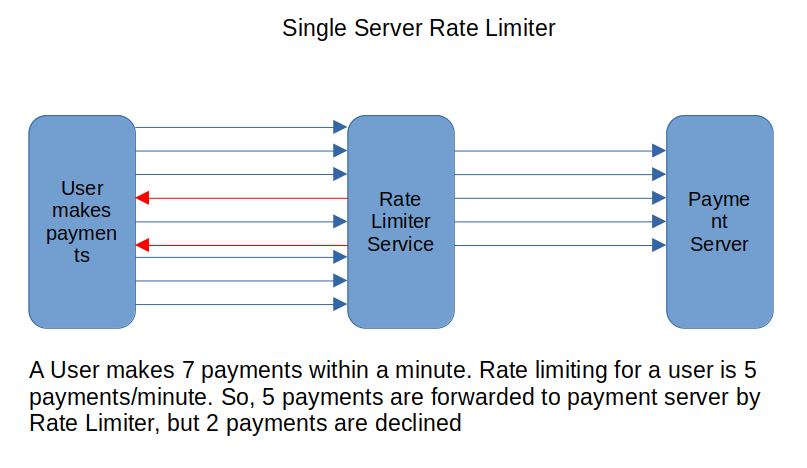

# Rate Limiter in Java (Single Server Architecture)
Problem Statement: A User is trying to make multiple payments within a specific time window. Only predefined number of payment requests should be allowed in the specific time window for the user, remaining requests should not be allowed. After the time window is over, the user will be able to make new payment requests.  
Algorithm Used: Token Bucket
Explanation: Each user has a bucket which has specific number of tokens, each payment request takes one token from the bucket and completes the payment. If the bucket is empty, new payment request will not be allowed. After the specific time window is over, the bucket will be refilled with tokens.  
Classes Used:  
User: POJO of User,  
RefillRate: Rate at which refilling happens - for example, 5 tokens will be refilled per minute,  
Payment: A thread which executes a payment. Payment is a allowed if RateLimiter provides a token, else payment is not allowed,   
Bucket: A bucket holds tokens, returns a token to each payment thread, refills itself with tokens per minute,  
RateLimiter: Gets a token for the user if present in the bucket and returns it to Payment, Else declines the Payment.  
  
  

Sample Output:  
***** Rate Limiter *****  
Payment: 2 started...  
Payment: 3 started...  
Payment: 7 started...  
Payment: 4 started...  
Payment: 0 started...  
Payment: 6 started...  
Payment: 1 started...  
Fetching token - token index: 0  
Fetching token - token index: 1  
Payment: 5 started...  
Fetching token - token index: 2  
Payment: 2 allowed  
Payment: 3 allowed  
Payment: 5 allowed  
Fetching token - token index: 3  
Payment: 1 allowed  
Fetching token - token index: 4  
Payment: 6 allowed  
Fetching token - token index: 5  
Fetching token - token index: 5  
Payment: 0 rate limited  
Payment: 4 rate limited  
Fetching token - token index: 5  
Payment: 7 rate limited  
Token Bucket is refilled  
